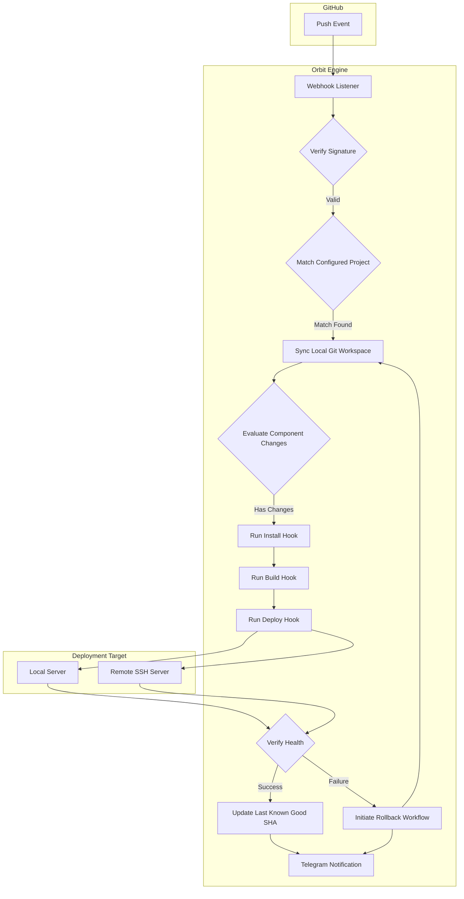
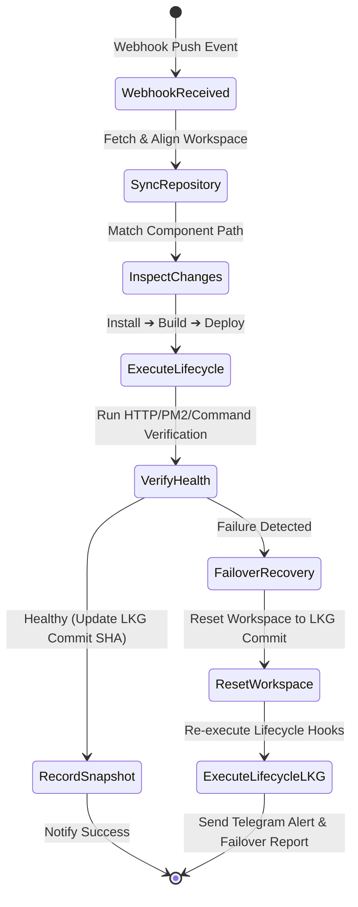

# Orbit CI/CD

Orbit is a lightweight, configuration-driven CI/CD engine designed to automate multi-project and multi-component deployments. Built on Node.js and Express, it provides smart change-detection for monorepos, automated dependency installation, and local or remote SSH deployment flows triggered via GitHub Webhooks.

---

## Architecture & Deployment Flow

Orbit processes incoming GitHub push events, determines modified scopes, executes deployment lifecycles, and manages system state recovery.



---

## Core Capabilities

* **Configuration-Driven**: Define projects and components in a single JSON schema.
* **Monorepo-First Change Detection**: Evaluates webhook commit diffs to build and deploy only modified directories/components.
* **Dynamic Dependency Audits**: Monitors dependency manifests (e.g. `package.json`) to invoke clean installs (`npm ci`) only when libraries are modified.
* **Dual Execution Modes**:
  * **Local**: Executes commands directly on the host hosting the Orbit server.
  * **Remote (SSH)**: Connects to external servers over SSH to perform zero-agent deployments.
* **Health Checks**: Assures operational status via HTTP requests, PM2 status validation, or custom commands before concluding a deployment.
* **Automated Failure Recovery (LKG)**: Reverts the target environment to the Last Known Good commit SHA if a deployment command or health check fails.
* **Telegram Integration**: Delivers notifications regarding pipeline execution status, warnings, and rollback statuses.

---

## Prerequisites

* **Node.js**: Version 20.6.0 or higher (for native `.env` file support)
* **Git**: System git installation
* **PM2**: Recommended for daemonizing the Orbit server
* **SSH Key**: SSH private key on Orbit server with access to remote servers (for remote deployment)

---

## Setup & Installation

### 1. Installation
Clone the repository and install runtime dependencies:
```bash
git clone <repository-url>
cd Custom-CICD-Server
npm install --omit=dev
```

### 2. Environment Setup
Configure the environment variables by creating a `.env` file in the root directory:
```env
PORT=5001
SERVER_URL=https://your-orbit-instance.com
GITHUB_SECRET=your-github-webhook-secret
GITHUB_TOKEN=your-github-personal-access-token
TELEGRAM_BOT_TOKEN=your-telegram-bot-token
TELEGRAM_CHAT_ID=your-telegram-chat-id
```

### 3. Server Initialization
Run the application using Node's native env file loading or daemonize using PM2:
```bash
# Development Mode
npm run dev

# Production Mode
pm2 start src/app.js --name orbit-cicd-server
pm2 save
```

### 4. GitHub Webhook Configuration
Add a webhook in your repository settings:
* **Payload URL**: `https://<your-server-ip-or-domain>/webhook/github`
* **Content type**: `application/json`
* **Secret**: Configure to match `GITHUB_SECRET` in `.env`
* **Events**: `push`

---

## Configuration Reference (`cicd-config.json`)

Configure your projects in [cicd-config.json](file:///home/beru/Desktop/Projects/Custom-CICD-Server/src/config/cicd-config.json).

```json
{
  "projects": [
    {
      "name": "My-App",
      "repository": "owner/repo",
      "branch": "main",
      "localPath": "/var/www/my-app",
      "components": [
        {
          "name": "API",
          "path": "backend/",
          "mode": "remote",
          "ssh": {
            "host": "1.2.3.4",
            "user": "deploy-user",
            "keyPath": "/path/to/key",
            "remotePath": "/home/ubuntu/api"
          },
          "commands": {
            "pull": "git pull origin main",
            "install": "npm ci",
            "deploy": "pm2 reload api-server"
          }
        }
      ]
    }
  ]
}
```

---

## Recovery Workflow (Last Known Good)

Orbit secures the last successful deploy state inside [lkg.json](file:///home/beru/Desktop/Projects/Custom-CICD-Server/src/store/lkg.json).



> [!WARNING]
> Rewriting git history via force-pushes or rebases can prune historical commits and may cause failover rollbacks to fail if the LKG SHA is no longer present in the commit graph.

---

## Project Structure

```
src/
├── app.js                       # Server entrypoint & configuration
├── routes/                      # Route controllers
│   ├── health.js                # Uptime checks
│   ├── runs.js                  # Deployment run status inquiries
│   └── webhook.js               # Webhook receiver & lifecycle controller
├── middlewares/                 # Express middlewares
│   └── verify-signature.js      # GitHub SHA256 HMAC validator
├── services/                    # Business logic services
│   ├── deploy-service.js        # Deployment pipeline controller
│   ├── git-services.js          # Git operations manager
│   ├── github-status-service.js # GitHub Commit Status updater
│   ├── health-service.js        # Health check checker
│   ├── lkg-service.js           # LKG storage worker
│   ├── rollback-service.js      # Rollback orchestrator
│   ├── ssh-service.js           # SSH command runner
│   └── telegram-service.js      # Telegram client notifier
├── store/                       # Persistence
│   ├── lkg.json                 # Persistent LKG record store (gitignored)
│   └── runs.js                  # In-memory execution database
└── utils/                       # Shared utility functions
    ├── cicd-error.js            # Custom error class
    ├── path-matcher.js          # File change path matcher
    └── validate-env.js          # Environment variable validator
```

---

## API Endpoints

### 1. Server Health
Returns the status of the Orbit server instance.
* **Method**: `GET`
* **Route**: `/health`
* **Response**:
  ```json
  {
    "status": "OK",
    "success": true,
    "message": "Server is healthy",
    "timestamp": "2026-07-12T10:00:00.000Z"
  }
  ```

### 2. Query Run Execution
Queries details of a specific deployment pipeline execution by commit SHA.
* **Method**: `GET`
* **Route**: `/runs/:commitSha`
* **Response**:
  ```json
  {
    "success": true,
    "project": "My-App",
    "repository": "username/my-app",
    "branch": "main",
    "commitSha": "f044ee7...",
    "status": "success",
    "startedAt": "2026-07-12T10:00:00.000Z",
    "finishedAt": "2026-07-12T10:02:00.000Z"
  }
  ```

### 3. Webhook Target
Ingests GitHub webhook payload. Signature is validated with HMAC-SHA256.
* **Method**: `POST`
* **Route**: `/webhook/github`

---

## Troubleshooting & Operations

### Diagnostics

| Symptom | Cause | Resolution |
| :--- | :--- | :--- |
| **HMAC Verification Fails (403)** | Webhook secret mismatch. | Validate that `GITHUB_SECRET` matches the webhook secret configured on GitHub. |
| **SSH Command Timed Out** | Network block or invalid credentials. | Verify target port (default 22) and assure private key permissions are set to `600`. |
| **Commit Statuses Missing** | Insufficient token scopes. | Assure the `GITHUB_TOKEN` is configured with `status:write` permission. |
| **Rollback Fails** | LKG SHA missing in Git history. | Verify origin remote configurations and fetch commit objects. |

### Manual Rollback
If manual intervention is required to recover a deployment:
1. Log in to the target system:
   ```bash
   ssh -i /path/to/key user@target-host
   ```
2. Reset to the target commit:
   ```bash
   cd /path/to/deployment
   git fetch --all && git reset --hard <target_commit_sha>
   ```
3. Restart process:
   ```bash
   npm ci && pm2 reload app-name
   ```
